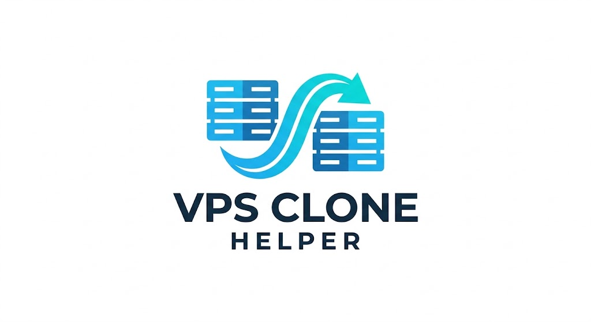

<h1 align="center"></h1>

**Dá ao Claude Code tudo que ele precisa para clonar uma VPS sozinho.** Aponte para um servidor em produção
(ou um Docker Swarm inteiro), diga onde a cópia deve ficar, e ele faz o resto: confere o seu ambiente,
inventaria a origem sem tocar nela, compra os servidores na *sua* conta, reconstrói a stack, copia os dados se
você quiser, configura DNS e TLS, prova que a cópia bate, endurece a segurança, configura backup e entrega um
manual de operação.

[Read in English](README.md)

## Começo rápido

```bash
git clone https://github.com/theohaiek/VPS-Clone-Helper
cd VPS-Clone-Helper
claude --dangerously-skip-permissions "clonar minha VPS"
```

Só isso. Na primeira execução o Claude mostra os riscos em duas linhas, verifica o que sua máquina tem
(Python, SSH, CLIs de provedores, servidores MCP, extensão do navegador), faz **uma única vez** todas as
perguntas necessárias e depois trabalha sem parar. Abriu sem a flag? Ele pede para reabrir com ela; nada se
perde, o trabalho continua de onde parou.

## Instalar como plugin (usar de qualquer pasta)

```text
/plugin marketplace add theohaiek/VPS-Clone-Helper
/plugin install vps-clone-helper@vps-clone-helper
```

Reabra o Claude Code com `claude --dangerously-skip-permissions` e rode `/vps-clone-helper:vps-clone` ou
diga "clonar minha VPS". A pasta de trabalho `.vps-clone/` é criada no diretório atual.

## Como funciona

| Fase | O que o Claude faz | Prova exigida para avançar |
|---|---|---|
| 0 Primeira execução | Aviso de risco em duas linhas, checa o modo de permissão | - |
| 1 Prontidão | `doctor.py`, briefing único (modo, conta de destino, teto de gasto, domínios, postura), testes de acesso | Todas as linhas OK |
| 2 Inventário | Inventário só leitura e export Docker de cada servidor de origem | Mapa da topologia escrito |
| 3 Plano | Estratégia, tamanhos, versões, política de senhas, ordem, custo | Cabe no briefing e no teto |
| 4 Provisionamento | Cria os servidores na sua conta (API, CLI, MCP ou navegador logado) | SSH com chave nova funciona |
| 5 Bootstrap | Versões exatas do engine, Swarm init/join, redes, volumes, imagens por digest | Imagens presentes em cada nó |
| 6 Deploy | Gera as stacks (domínios novos, senhas novas, digests) e sobe na ordem certa | Todos os serviços saudáveis |
| 7 Dados | Preparo "só configuração" ou dumps e volumes em streaming | Contagens batem |
| 8 DNS + TLS | Registros no seu provedor de DNS, certificados | Certificado de CA real em cada host |
| 9 Verificação | Diff de spec origem x destino, DNS do overlay, testes de fumaça | Toda diferença corrigida ou explicada |
| 10 Segurança | Firewall que o Docker não fura, SSH só por chave, logs, swap, updates, backup, teste de reboot | Restore e reboot testados |
| 11 Entrega | `OPERATIONS.md`, limpeza, relatório curto | - |

Tudo fica em `.vps-clone/STATE.md`: qualquer sessão nova continua exatamente de onde a anterior parou.

## O que você precisa

- [Claude Code](https://code.claude.com) e Python 3.8+ (o `doctor.py` instala o único pacote necessário, `paramiko`).
- Acesso SSH ao(s) servidor(es) de origem: IP, usuário, senha ou chave.
- Conta no provedor de destino. Ideal: token de API ou login de CLI (Hetzner `hcloud`, DigitalOcean `doctl`,
  Vultr, Linode, AWS, GCP, Oracle, OVHcloud, Hostinger, Contabo). Também funciona com servidor MCP do
  provedor ou com seu navegador logado via extensão Claude in Chrome.
- Acesso ao DNS do domínio de destino (token de API, MCP ou navegador).

O doctor diz exatamente o que falta e como resolver.

## Modelo de segurança

- **A origem é só leitura.** Servidores registrados como `source` recusam comandos que alteram estado; dados
  trafegam por `sshx.py pipe`, que não grava nada na origem.
- **Seu dinheiro, seu teto.** Compras só na conta e dentro do teto mensal do briefing, depois de conferir a
  conta mostrada pelo provedor.
- **Segredos ficam locais.** Credenciais, chaves, inventários e senhas novas ficam em `.vps-clone/` (ignorado
  pelo git, chmod 600) e em arquivos só-root nos servidores novos.
- **Mesma topologia.** Dois servidores continuam dois; papéis e placement preservados.
- **Evidência antes de "pronto".** Cada fase termina com uma checagem, e as diferenças da origem ficam
  listadas com o motivo.
- `--dangerously-skip-permissions` deixa o Claude executar comandos sem perguntar. Use numa pasta dedicada a
  este trabalho e leia o aviso de duas linhas.

## Suporte

| | Status |
|---|---|
| Docker Swarm (Portainer, Traefik) | Comprovado num clone real de 2 nós |
| Hosts com docker compose | Mesmo fluxo de export/render |
| Hosts systemd puros (nginx, PHP, Node, bancos nativos) | Reconstrução guiada pelo inventário |
| Kubernetes / k3s, painéis (cPanel, Plesk, CapRover, Coolify) | Guiado: usa a migração nativa deles |
| Provedores | Qualquer um com SSH; comandos documentados para 10; compra por API, CLI, MCP ou navegador |
| Sua máquina | Windows (Git Bash), macOS, Linux |

## Problemas comuns

- O Claude fica pedindo permissão: reabra com `claude --dangerously-skip-permissions`.
- `paramiko missing`: `python -m pip install --user paramiko` (ou `doctor.py --fix`).
- Qualquer outra coisa: `skills/vps-clone/references/pitfalls.md` lista cada falha já vista, com a correção.

## O que tem dentro

```
assets/                  logo
.claude-plugin/          manifests do plugin e do marketplace
hooks/                   hook de prompt: modo de permissão real, protocolo da 1ª execução, estado do trabalho
CLAUDE.md                protocolo da 1ª execução quando você abre o Claude nesta pasta
skills/vps-clone/
  SKILL.md               o playbook (fases, regras, comandos)
  references/            profundidade por fase: provedores, Docker/Swarm, dados, DNS/TLS, segurança, armadilhas, caso real
  templates/             BRIEF.md, STATE.md, OPERATIONS.md
  scripts/               doctor.py, sshx.py, stacks.py, parity.py e remote/ (rodam nos servidores)
```

## Atualizar

Repo: `git pull`. Plugin: `/plugin marketplace update vps-clone-helper`. Trabalhos em andamento continuam
funcionando: o formato da pasta `.vps-clone/` é estável dentro da mesma versão major.

## Contribuir

Issues e pull requests são bem-vindos, principalmente comandos de provedores testados em contas reais e novas
armadilhas com a correção. Scripts idempotentes, Python só com biblioteca padrão, e nunca IPs, domínios ou
credenciais reais (o CI recusa IPs e e-mails que não sejam de exemplo). Rode `bash tests/run.sh` antes do PR.

Abrir o Claude Code dentro desta pasta inicia o protocolo de clonagem (é o produto). Para trabalhar no próprio
toolkit, diga isso na primeira mensagem.

## Licença

[MIT](LICENSE)
